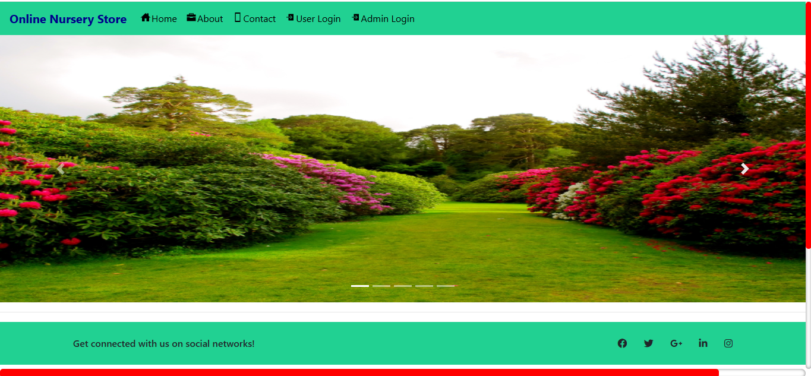

# Online Nursery Store

A Django-based web application for an online nursery store where users can browse, purchase, and manage nursery products such as plants, seeds, and gardening supplies.




## Table of Contents

- [Features](#features)
- [Technology Stack](#technology-stack)
- [Prerequisites](#prerequisites)
- [Installation](#installation)
- [Database Setup](#database-setup)
- [Running the Application](#running-the-application)
- [Usage](#usage)
- [Project Structure](#project-structure)
- [Contributing](#contributing)
- [License](#license)
- [Contact](#contact)

## Features

- **User Authentication**: User registration, login, and profile management
- **Product Catalog**: Browse products by categories (e.g., fruits, vegetables, plants)
- **Shopping Cart**: Add/remove products to/from cart
- **Order Management**: Place orders and track booking status
- **Admin Panel**: Manage products, categories, orders, and users
- **Image Upload**: Product images and user profile pictures
- **Responsive Design**: Mobile-friendly interface
- **Search and Filter**: Find products easily

## Technology Stack

- **Backend**: Django 3.1.2
- **Database**: MySQL
- **Frontend**: HTML, CSS, JavaScript, Bootstrap
- **Python Version**: 3.12
- **Other Libraries**: Pillow (for image handling), MySQL client, etc.

## Prerequisites

Before running this project, ensure you have the following installed:

- Python 3.12
- MySQL Server
- Git (for cloning the repository)
- Virtual environment tool (venv)

## Installation

1. **Clone the repository**:
   ```bash
   git clone <repository-url>
   cd "nursery shop"
   ```

2. **Create a virtual environment**:
   ```bash
   python -m venv myenv
   ```

3. **Activate the virtual environment**:
   - On Windows:
     ```bash
     myenv\Scripts\activate
     ```
   - On macOS/Linux:
     ```bash
     source myenv/bin/activate
     ```

4. **Install dependencies**:
   ```bash
   pip install -r requirements.txt
   ```

## Database Setup

1. **Create a MySQL database**:
   - Open MySQL command line or a GUI tool like phpMyAdmin
   - Create a database named `final` (or update the name in `settings.py`)

2. **Update database credentials**:
   - Open `online_nursery_store/settings.py`
   - Modify the `DATABASES` configuration with your MySQL credentials:
     ```python
     DATABASES = {
         'default': {
             'ENGINE': 'django.db.backends.mysql',
             'NAME': 'final',  # Your database name
             'USER': 'root',   # Your MySQL username
             'PASSWORD': '12345',  # Your MySQL password
             'HOST': 'localhost',
             'PORT': '3306',
         }
     }
     ```

3. **Run migrations**:
   ```bash
   python manage.py makemigrations
   python manage.py migrate
   ```

4. **Create a superuser** (for admin access):
   ```bash
   python manage.py createsuperuser
   ```

## Running the Application

1. **Start the development server**:
   ```bash
   python manage.py runserver
   ```

2. **Access the application**:
   - Open your browser and go to `http://127.0.0.1:8000/`
   - Admin panel: `http://127.0.0.1:8000/admin/`

## Usage

### For Users:
- Register/Login to create an account
- Browse products by category
- Add products to cart
- Proceed to checkout and place orders
- View order history and status

### For Admins:
- Login to admin panel
- Manage products, categories, and orders
- View user information and bookings
- Update product inventory and status

## Project Structure

```
nursery shop/
├── manage.py
├── requirements.txt
├── db.sqlite3
├── online_nursery_store/
│   ├── __init__.py
│   ├── settings.py
│   ├── urls.py
│   └── wsgi.py
├── grocery/
│   ├── __init__.py
│   ├── admin.py
│   ├── apps.py
│   ├── models.py
│   ├── tests.py
│   ├── views.py
│   ├── migrations/
│   ├── static/
│   │   ├── css/
│   │   ├── images/
│   │   └── js/
│   └── templates/
├── media/
└── myenv/
```

## Contributing

1. Fork the repository
2. Create a feature branch (`git checkout -b feature/AmazingFeature`)
3. Commit your changes (`git commit -m 'Add some AmazingFeature'`)
4. Push to the branch (`git push origin feature/AmazingFeature`)
5. Open a Pull Request

## License

This project is licensed under the MIT License - see the [LICENSE](LICENSE) file for details.

## Contact

- Project Link: [GitHub Repository URL]
- Email: [Your Email]
- LinkedIn: [Your LinkedIn Profile]

---

**Note**: This is a development version. For production deployment, ensure to:
- Set `DEBUG = False` in settings.py
- Configure proper security settings
- Use a production-grade web server like Nginx + Gunicorn
- Set up proper database credentials and backups
